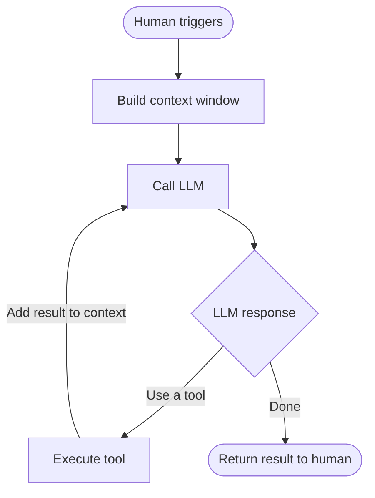
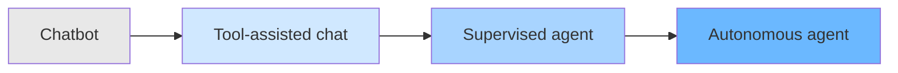

# Agent Fundamentals

## Chatbot vs Agent

The key distinction is **who drives the loop**.

```
Chatbot:  Human → LLM → Human → LLM → Human ...
Agent:    Human triggers → LLM → Tool → LLM → Tool → LLM → ... → Result → Human
```

A chatbot routes messages. An agent runs autonomously between trigger and result.

-----

## The Agent Loop

The **process** is the agent. The LLM is a stateless reasoning engine it calls.



> The LLM has no idea it’s in a loop. It only sees the current context window and responds.

-----

## Context Window = Agent’s Entire Reality

Everything the agent knows at any moment lives in the context window:

|What it feels like  |What it actually is             |
|--------------------|--------------------------------|
|Memory (CLAUDE.md)  |Text loaded into context        |
|Tool results        |Observations appended to context|
|Instructions        |Text at the top of context      |
|Conversation history|Prior turns in context          |

**Managing what goes into the context window is the core design challenge of agentic systems.**

-----

## The Agent Spectrum

Agents aren’t binary — it’s a spectrum defined by **autonomy depth** (how many reasoning-action cycles run before a human sees anything).



|Stage             |Example                    |Human involvement                |
|------------------|---------------------------|---------------------------------|
|Chatbot           |Claude.ai plain chat       |Every turn                       |
|Tool-assisted chat|Claude.ai with tools       |Every turn, sees each tool call  |
|Supervised agent  |Claude Code while you watch|Triggered + monitoring           |
|Autonomous agent  |Claude Code in CI          |Triggered, sees final result only|

**The further right, the more the process owns the loop.**

-----

## Key Takeaways

- An **agent is the process**, not the LLM
- The **LLM is stateless** — it only knows what’s in context right now
- Agents reason in **pulses**: infer → act → observe → repeat
- **Autonomy depth** is what separates an agent from a chatbot
- All memory, tools, and instructions are just **context management**