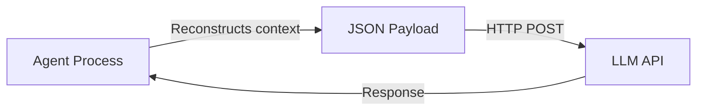

# Context & Context Window

## What is Context?

Every LLM call is a fresh HTTP request. The agent reconstructs the full context and sends it every single time. The LLM has no memory between calls — **the agent process owns continuity**.



> There is no persistent connection. No session. The LLM is stateless.

-----

## Structure of a Context Payload

Sent as JSON over HTTP every call:

```json
{
  "model": "claude-sonnet-...",
  "system": "You are... [developer instructions]",
  "messages": [
    { "role": "user", "content": "Do X" },
    { "role": "assistant", "content": "...[reasoning + tool call]..." },
    { "role": "user", "content": "[tool result: ...]" }
  ]
}
```

Images, PDFs, documents are embedded as base64 blocks inside this structure. Tool results are special message types, not plain conversation turns.

-----

## System Prompt

- Written by the **agent developer**, not the user
- Loaded before any conversation begins
- Users never see it directly
- Contains: agent identity, core instructions, tool definitions, safety rules, behavioral constraints

**Prompt injection** — a real attack vector where malicious content inside a tool result (e.g. a webpage the agent read) tries to override or hijack system prompt authority. Enforcement must be architectural, not just instructional.

-----

## Context Management Strategies

Agents can’t grow context forever — there’s a hard token limit. Developers choose how to manage it:

|Strategy               |How it works                                               |Trade-off                                 |
|-----------------------|-----------------------------------------------------------|------------------------------------------|
|**Always include**     |Static content always in context (CLAUDE.md, system prompt)|Takes up space but always available       |
|**Sliding window**     |Keep last N turns, drop older ones                         |Simple, but loses history                 |
|**Summarization**      |Compress old history into a paragraph via LLM call         |Space-efficient, but lossy                |
|**RAG**                |Fetch relevant chunks from external storage on demand      |Scalable, but adds latency and complexity |
|**Tool result pruning**|Summarize large tool outputs before adding to context      |Prevents bloat from verbose tool responses|

Most real agents combine several strategies.

-----

## Who Decides What Goes in Context?

**The developer** — baked into the agent’s architecture, not decided at runtime by the agent itself. Common approaches:

- Fixed token budget (e.g. “keep until 80% of limit, then drop oldest”)
- Turn count limit (e.g. “keep last 20 turns”)
- Importance scoring (recent actions, errors, and goals prioritized)

Claude Code uses token-budget-aware logic rather than a fixed turn count.

-----

## Context Compaction

Claude Code’s **context compaction** = summarization strategy in practice.

When the context approaches its limit, Claude Code runs a summarization pass — compressing conversation history into a compact representation — freeing space to continue the task.

-----

## Does Context Size Affect Performance?

**Yes.** Larger context → more tokens to process → longer time to first token. Not always linear, but the relationship is real. This is a practical reason context management matters beyond just hitting hard limits.

-----

## Why JSON and Not Something More Efficient?

- Convention and universal tooling support
- Human-readable — critical for debugging agentic systems
- The bottleneck is **inference time**, not serialization — JSON overhead is noise

Binary alternatives (MessagePack, Protobuf) exist but aren’t worth the tradeoff given where the actual cost sits.

-----

## Why Not WebSockets for Long Sessions?

The streaming API already uses **Server-Sent Events (SSE)** — tokens stream back as generated, so you don’t wait for a full response.

But WebSockets wouldn’t solve the core issue: **the statelessness is in the model, not the transport layer.** Even with a persistent connection, the full context still has to be reconstructed and sent for each reasoning call. There’s no server-side state to maintain between calls.