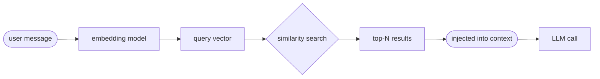

# RAG & Agent Memory

## The Core Problem

LLMs are stateless. Context windows are finite. You can't simply keep appending all past conversations — there is a hard token limit, and larger context means slower inference. Something external has to hold the memory.

> The challenge isn't storing memories. It's retrieving the right ones at the right moment — without the LLM having to ask.

-----

## The RAG Pipeline

RAG — Retrieval-Augmented Generation — solves this by automatically fetching relevant context before the LLM is called. The user's message itself becomes the retrieval query.

> ⚠ Retrieval happens **before** the LLM is called. The agent process runs this automatically — no LLM instruction needed.

This answers the core question: the agent doesn't "know" to fetch because the user mentioned a topic. Retrieval is automatic — the user's words become a vector, relevant memories surface, and by the time the LLM sees the context window, they're already there.

-----

## Vector Embeddings

A model converts text into a list of numbers — coordinates in a very high-dimensional space. Crucially, **similar meanings produce coordinates that are close together**. Embeddings aren't assigned by rules — they emerge from training on billions of sentences.

> **Classic example:** vector("king") − vector("man") + vector("woman") ≈ vector("queen") — vector arithmetic encodes real semantic relationships. The geometry has meaning.

**Cross-lingual**: Multilingual models map meanings across languages — "dog" (EN) and "hund" (DE) land close together. Idioms are less reliable since surface words mislead the model.

**Same model rule**: Store and query must use the same embedding model. Each model invents its own axes during training — coordinates are not comparable across different models.

**Why the same model?**: Unlike physical maps, embedding space has no fixed territory. Different models organise dimensions differently — no shared ground truth exists to derive a transformation from.

-----

## Two Retrieval Approaches

RAG is not the only way to retrieve external knowledge. There are two distinct patterns, and real systems often combine them.

| Approach | Who triggers it | When | Best for |
|---|---|---|---|
| **RAG pipeline** | Agent process, automatically | Before every LLM call | Always-needed knowledge: rules, guidelines, persona, constraints |
| **Tool-call** | LLM outputs instruction → agent executes | When LLM recognises a gap in context | On-demand knowledge: user history, optional references |

-----

## Vector Database Design

Unmanaged external storage just moves the bloat problem elsewhere. Good vector DB design is essential.

**Similarity threshold**: Only return results above a relevance score. Prevents injecting loosely related noise into context.

**Top-N limiting**: Return only the N most similar results. Developer-defined constant balancing relevance vs. context bloat.

**Memory curation**: Old or redundant entries should be pruned or summarised over time — unmanaged storage recreates the bloat problem externally.

**Approx. nearest neighbour**: Efficient algorithms find closest vectors at scale — without comparing every stored entry on every query.

-----

## Key Takeaways

- **RAG answers the core question:** the agent doesn't "know" to fetch — the user's message is the query vector, retrieval is automatic.
- **Relevance, not recency:** what gets retrieved is semantically closest to the input, not necessarily most recent.
- **Same embedding model always:** must be consistent between store and query — different models invent different axes.
- **Pipeline vs. tool-call:** always-needed knowledge uses fixed pipeline; optional knowledge uses tool-triggered retrieval.
- **External storage doesn't eliminate bloat:** it moves the curation problem — vector DBs still need maintenance.
